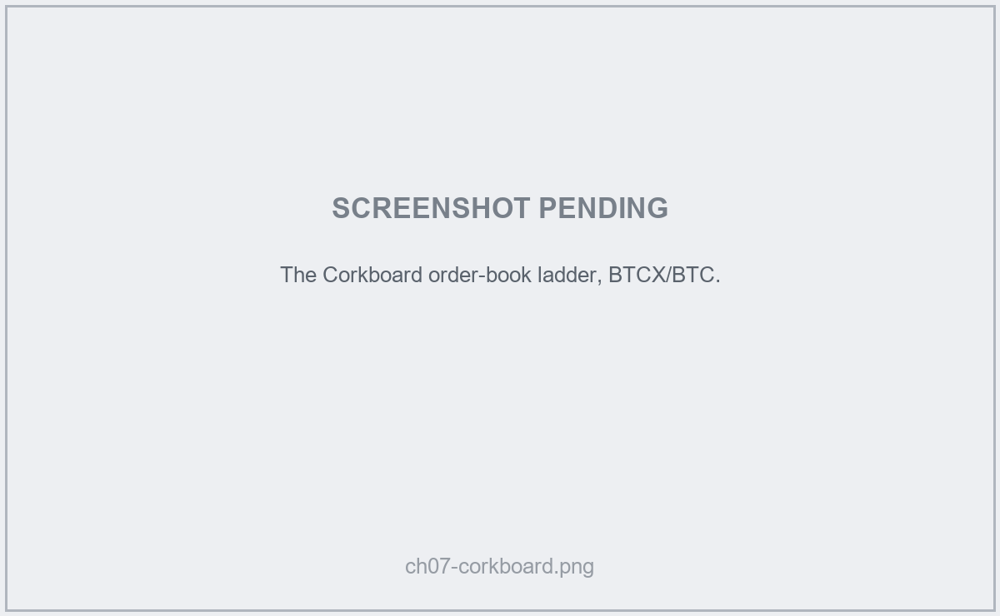

# Satchel — User Handbook

Source files for the **Satchel User Handbook**. The handbook is written in
Markdown (one file per chapter) and built into a single PDF with Pandoc +
xelatex. It is the end-user guide: installing Satchel, setting up coins, and
trading trustlessly over the Corkboard and Nostr.

For the engine that powers Satchel, see the **Pact Developer & Integrator
Handbook** in `../handbook-pact/`. The two handbooks are kept in sync; where a
topic is shared (atomic swaps, transports, the security model), the user
handbook explains the *what* and *why* and the Pact handbook covers the *how*.

## Prerequisites

- **Pandoc 3.0 or newer** — <https://pandoc.org/installing.html>
- **A LaTeX distribution** that provides `xelatex`:
    - Windows: [MiKTeX](https://miktex.org/) (auto-installs missing packages on first build)
    - macOS: [MacTeX](https://www.tug.org/mactex/)
    - Linux: `texlive-xetex texlive-fonts-recommended texlive-latex-extra`

## Building the PDF

From this directory:

    .\build.ps1

The output is written to `../satchel-handbook.pdf`. The first build under MiKTeX
takes longer because it downloads several LaTeX packages on demand.

## Project layout

    handbook-satchel/
    ├── chapters/          one Markdown file per chapter or part divider
    ├── images/processed/  screenshots referenced by the chapters
    ├── metadata.yaml      title, version, fonts, page setup
    ├── style.tex          LaTeX header includes (page numbers, header bar)
    ├── build.ps1          PowerShell build script
    └── README.md          this file

## Editing conventions

- One file per chapter under `chapters/`. Filenames use the prefix `chNN-…` so
  they sort naturally.
- Part dividers (`part1.md`, `part2.md`, …) each contain a single LaTeX
  `\part{…}` command.
- The build script lists every input file explicitly. To add a chapter, append
  it to the `$inputs` array in `build.ps1`.

### Screenshots

Screenshots live in `images/processed/` and are referenced from the chapters
with a standard Markdown image plus a width hint, for example:

    {width=85%}

Many screenshots are not yet captured; the chapters that need them carry a
visible placeholder and an entry in `images/SCREENSHOTS.md` listing the exact
screen, app state, and filename to capture. Use the chapter prefix (`chNN-…`) in
the filename to keep image assets grouped with their chapter.

### Callouts

Callouts are blockquotes with a leading bold tag. Three variants are used:

    > **Tip** — A helpful suggestion.

    > **Note** — Useful background information.

    > **Warning** — An action that can cause loss of funds or data.

### Text styles

- **Bold** for names of buttons, fields, menus, and on-screen labels.
- `Monospace` for file paths, commands, and exact text the user types.
- *Italics* for new terms when first introduced.
